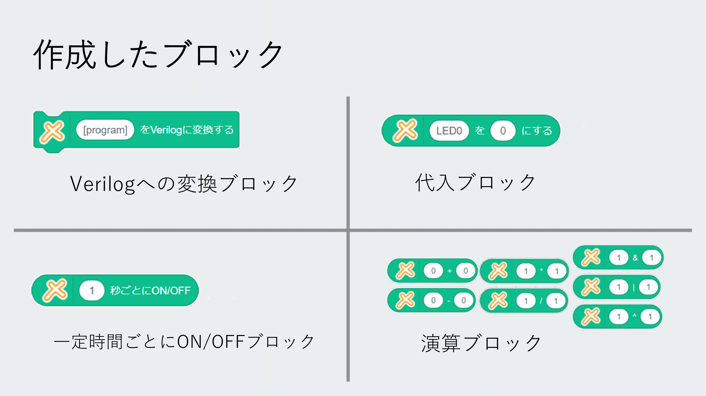
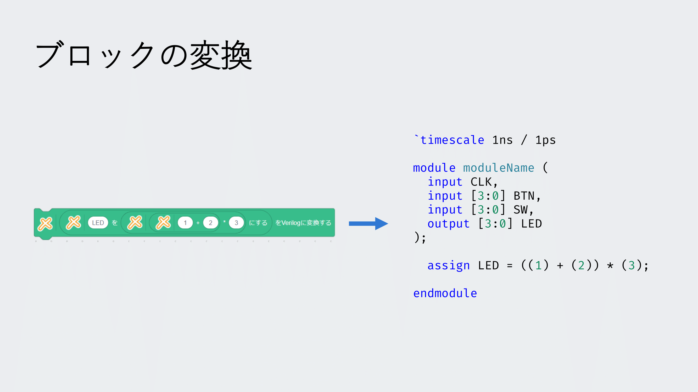

# Scratch ブロックから Verilog への変換を行う Xcratch 拡張機能 : Convert Scratch Block to Verilog for Xcratch Extension

この [Xcratch](https://xcratch.github.io/) 用拡張機能では，Scratch ブロックから Velilog への変換を行うことができます．

[こちら](https://xcratch.github.io/editor/#https://HitsujiRere.github.io/scratch2verilog/projects/example.sb3)で実際に使ってみることができます．

<iframe src="https://xcratch.github.io/editor/#https://HitsujiRere.github.io/scratch2verilog/projects/example.sb3" style="width:100%; aspect-ratio:16/9;"></iframe>

## ✨ できること

以下の画像の全 10 種類のブロックを用いてプログラムを記述し，Verilog へ変換することができます。





## 🛠️ Xcratch で使う方法

[Xcratch](https://xcratch.github.io/) 上で他の拡張機能と共に用いることができます．

1. [Xcratch Editor](https://xcratch.github.io/editor) を開く
1. 左下の「拡張機能を追加」ボタンをクリック
1. 「拡張機能を読み込む」を選択する
1. 入力フォームに以下の URL を入力する

```
https://HitsujiRere.github.io/scratch2verilog/dist/scratch2verilog.mjs
```

## ローカル環境での実行方法

参考: https://xcratch.github.io/docs/ja/#/how-to-make-extension

### 環境設定

1. この README.md が置いてあるフォルダをローカルに置く（もしくは https://github.com/HitsujiRere/scratch2verilog から clone してくる）

```
scratch2verilog
├─ dist
├─ projects
├─ src
└─ README.md
```

2. `npm install` を行う

```
cd scratch2verilog
npm install
```

3. scratch2verilog が置いてあるディレクトリに xcratch/scratch-gui を clone する

```
.
├─ scratch2verilog
│   ├─ dist
│   ├─ projects
│   ├─ src
│   └─ README.md
└─ scratch-gui
```

```
git clone -b xcratch https://github.com/xcratch/scratch-gui.git
cd scratch-gui
npm install
```

### ローカルの Xcratch への登録

1. scratch2verilog 上で、Xcratch エディタに登録する

```
cd scratch2verilog
npm run register
```

2. scratch-gui の dev-server を起動する

```
cd scratch-gui
npm run start -- --https
```

### モジュールの構築

1. モジュールファイルをビルドする

```
cd scratch2verilog
npm run build
```

2. Xcratch 上で用いるためにサーバを建てる（ VSCode の Extension である Live Server など）

3. Xcratch へ拡張機能を読み込む（ VSCode の Live Server の場合、 https://localhost:5500/dist/scratch2verilog.mjs ）
